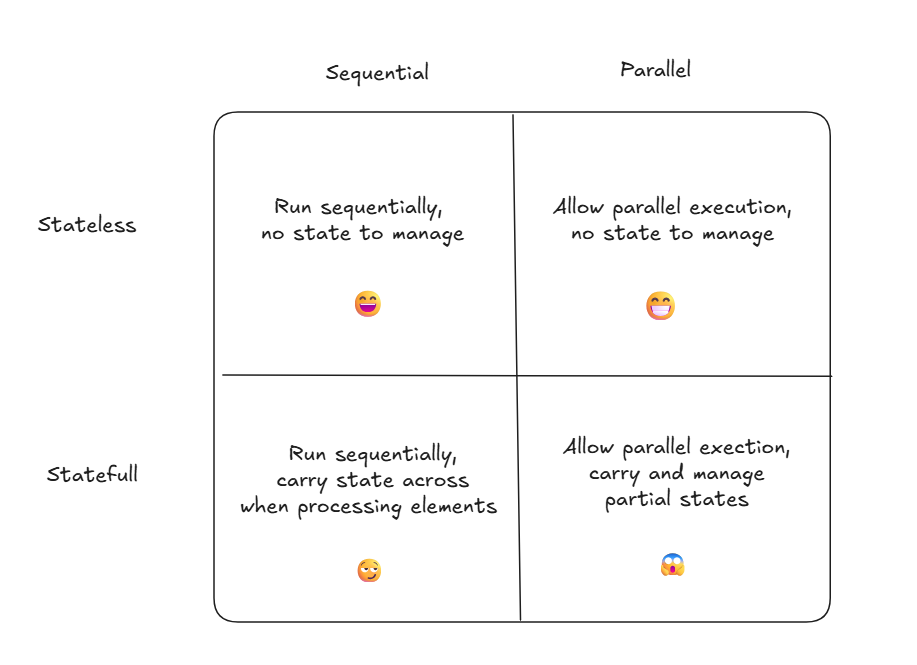
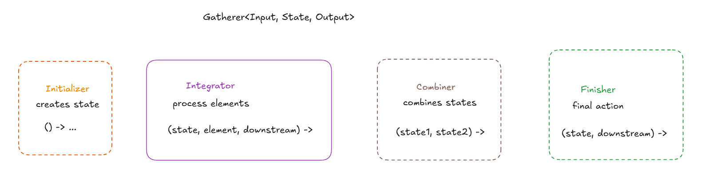
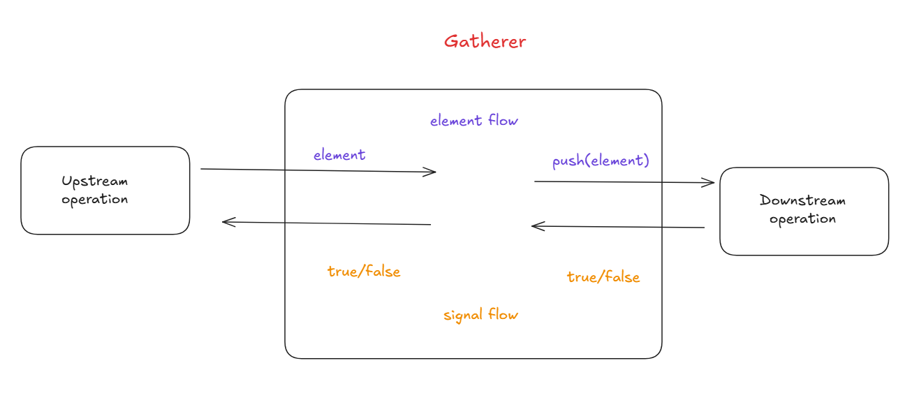
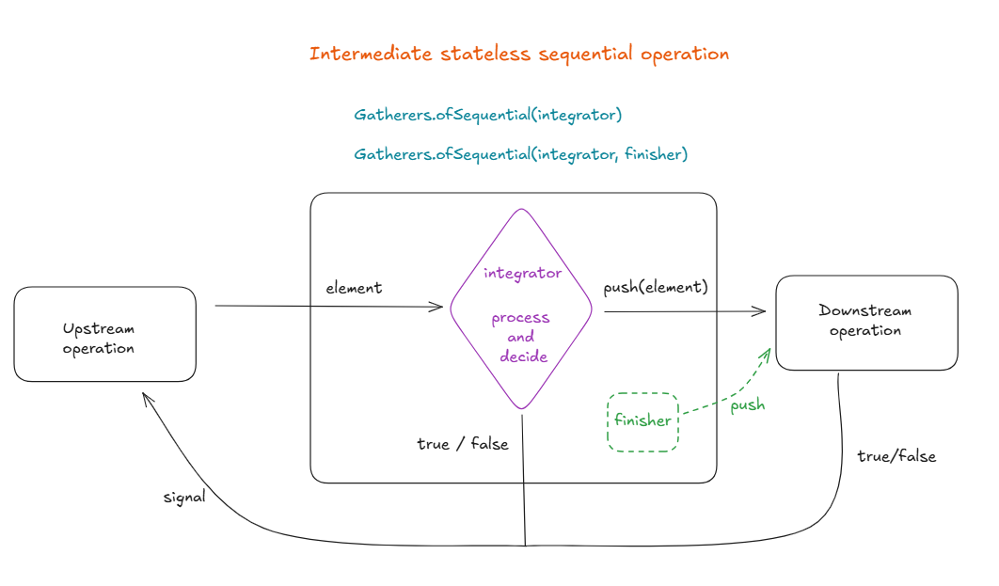
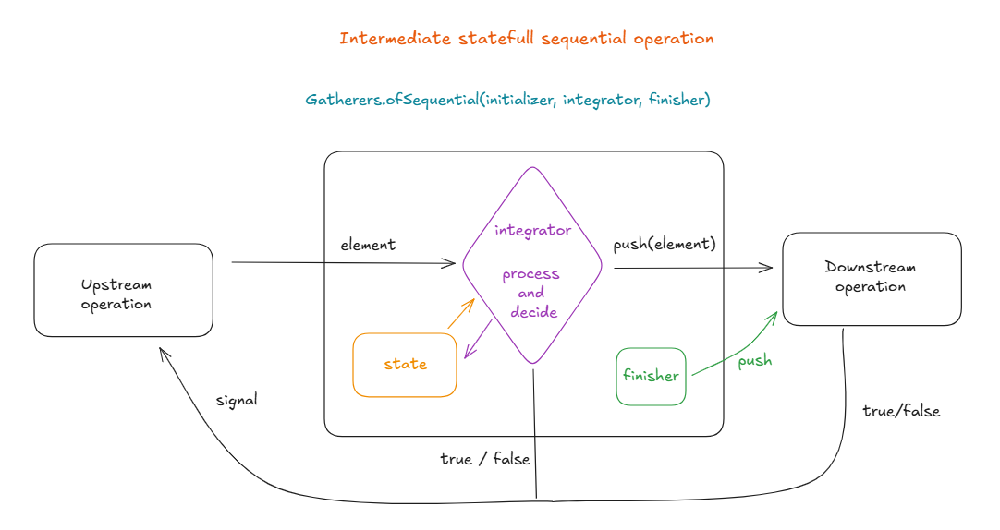
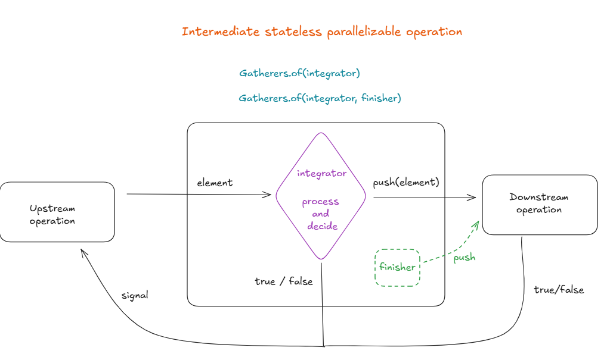
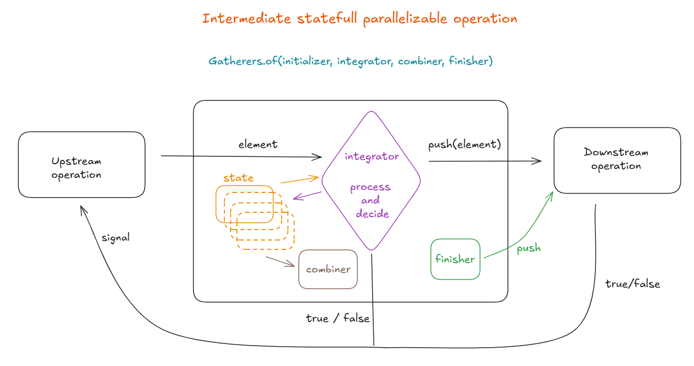

# 🎉 Crazy-Gatherers

The `crazy-gatherers` module contains the **`CrazyGatherers`** class, which provides a series of hands-on exercises designed to help you **master Java Stream Gatherers** .

This module is a practical companion to the Medium article [**“Mastering the Gatherer API in Java 25”**](https://medium.com/@roman.novosad87/master-gatherer-api-in-java-25-6e119f5a45e2)

The exercises in `CrazyGatherers` progress from simple operations—like filtering, mapping, and printing elements—to more advanced stream operations such as folding, scanning, windowing, and handling parallel streams. Each exercise demonstrates how custom Gatherers can mimic or extend standard stream operations, providing a practical way to understand the mechanics of streams.

The name "CrazyGatherers" was inspired by the set of **'Crazy' exercises by Bobocode**, which you can find here [Crazy exercises by Bobocode](https://github.com/bobocode-projects/java-fundamentals-exercises/tree/main/5-0-functional-programming)

## 🛠 Requirements

You should have **Java 25** installed to compile and run this module.

## ✨ Features

- 🏗 Hands-on exercises for learning custom Gatherers.
- 📌 Examples of standard stream operations using Gatherers:
    - `filter`, `map`, `peek`, `flatMap`, `limit`, `skip`, `takeWhile`, `dropWhile`, `distinct`, `sorted`
- 🚀 Advanced custom operations:
    - Folding and scanning elements
    - Windowing elements into batches
    - Collapsing consecutive duplicates
    - Sampling elements at regular intervals
    - Extracting increasing sequences
- 🔄 Sequential and parallel stream handling

- ⚡ **GathererParallelismDemo**:
  - Demonstrates the difference between **parallel** and **sequential gatherers**.
  - Shows how thread usage differs in upstream, gatherer, and downstream stages.
  - Provides an observable way to understand **parallelism behavior** in streams with custom gatherers.
  
- ⚡ **GathererPerformanceDemo**:
  - Compares execution time of **standard `map()`** vs a **sequential `Gatherer`**.
  - Shows why `map()` is faster for stateless transformations while gatherers allow **flexible stateful operations**.
  - Helps understand the **performance implications** of using gatherers for simple transformations.

## ✅ Tests and Completed Solutions

Each method in `CrazyGatherers` is covered by tests in `org.example.CrazyGatherersTest`. You can run these tests to validate your solutions.

If you ever get stuck or want to see reference implementations, you can check the **`completed`** branch in the project.

## 🔍 Additional resources

- [Extending Functional Pipeline with Gatherers by Venkat Subramaniam](https://www.youtube.com/watch?v=qgGIIpsF050)
- [Stream Gatherers - Deep Dive with the Expert](https://www.youtube.com/watch?v=v_5SKpfkI2U)
- [Better Java Streams with Gatherers - JEP Cafe #23](https://www.youtube.com/watch?v=jqUhObgDd5Q)

## 📖 Libraries
- [Gatherers4j](https://github.com/tginsberg/gatherers4j)
- [more-gatherers](https://github.com/pivovarit/more-gatherers)

## 📚 Visuals

